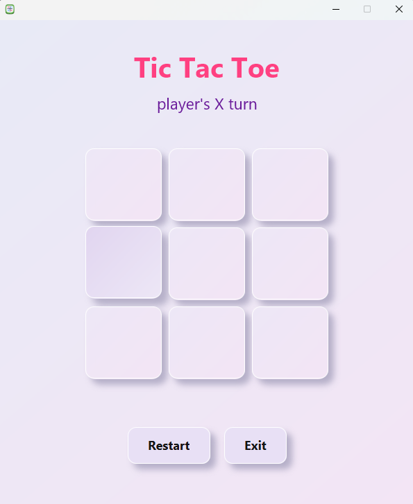

# JavaFX Tic Tac Toe

A simple Tic Tac Toe game built using **JavaFX**, **FXML**, and **CSS**.  
The project demonstrates clean controller logic, event handling, and UI separation using FXML.

---

## Features

- Classic 3x3 Tic Tac Toe board
- Two-player mode:
    - Player X
    - Player O
- Displays current player’s turn
- Automatically detects:
    - Win condition
    - Draw condition
- Restart button to reset the game
- Exit button to close the application
- UI styled using CSS
- Logic handled through a dedicated JavaFX controller

---

## Technologies Used

| Technology | Purpose |
|-----------|---------|
| **JavaFX** | UI framework |
| **FXML** | UI layout structure |
| **CSS** | Styling |
| **Java** | Game logic |
| **IntelliJ IDEA** | Development IDE |

---

## UI Preview

